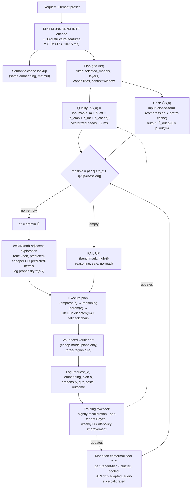

# FLIGHTPLAN — Nadir Router V3 Final Design

**The execution-plan compiler router.**
*Don't pick a model. Compile the cheapest execution plan — (model, reasoning effort, compression level, cache strategy) — that clears a conformally-controlled quality floor.*

| | |
|---|---|
| Status | **FINAL — approved by judge panel (wildcard angle), critiques resolved** |
| Date | 2026-06-10 |
| Supersedes | `wide_deep_asym` (λ=20 champion), NadirRoute (`cost_aware`), satisfaction predictor (dead code), ε-constrained `model_ranker` |
| Owner | Routing / ML |
| Codebase | `getnadir.dev/backend` (production), `getnadir.dev/eval` (arena harness), `Nadir/eval` (monorepo eval + contamination audit), `Nadir/nadir` (Pro plugin) |

---

## 1. Executive summary

Every router in the literature — and Nadir's own NadirRoute — answers *"which model?"*. FLIGHTPLAN answers *"which plan?"*: it routes in the joint action space **a = (model m, reasoning effort e, compression mode c, cache strategy k)**, exploiting a structural property only a gateway has — the **input-side** cost of a plan is closed-form arithmetic (token counts × compression factor × provider cache-read multipliers), while output-side cost is **predicted by a measured quantile regressor** and quality is predicted by calibrated per-model heads plus small additive "knob-delta" heads. FLIGHTPLAN enumerates the ~40–80 valid plans per request, computes effective cost for each, and picks the **cheapest plan whose calibrated quality clears a per-tenant conformal floor**, failing *up* to the benchmark model when nothing clears.

What is new versus the current production stack:

1. **Plan-space routing** (4 knobs, shipped in 3 stages: model×effort first) instead of model-only routing.
2. **Output-token cost prediction** (p50/p90 quantile GBT on completion + reasoning tokens) — fixes the documented "blended price assumes 1:1 in:out" gap; on Claude pricing (Opus 4.6: $15/M in, $75/M out, per `cost_calculation_service.py`) output is 5× input price and thinking tokens are pure output cost.
3. **Per-tenant conformal risk control** with a customer-facing α knob ("max expected downgrade rate"), calibrated on a **uniformly random dual-arm audit slice** so the guarantee is statistically valid — replacing both λ=20 and the fixed τ=0.80/0.95.
4. **One encoder** (MiniLM-L6-v2 384-d ONNX INT8) replacing the 3-encoder zoo; the embedding is persisted per request (consent-gated), turning the log stream into a training corpus.
5. **Propensity-logged exploration + doubly-robust off-policy evaluation**, plus a weekly per-tenant V̂_DR scorecard ("your router got X% cheaper at equal quality this week").
6. **Probe-battery cold start** for new models (LOMO AUC gate ≥0.70 from probes alone, ≥0.80 after 500 production rows) replacing the honest-AUC-0.52 price-features path.

### Expected gains vs current system (honest ranges; all are *gates*, not promises)

| Metric | Current (measured) | FLIGHTPLAN target | Confidence / basis |
|---|---|---|---|
| Production savings vs always-Opus | **−48.2%** at 0/497 catastrophic (wide_deep λ=20 champion) | Stage A (model×effort): **−53% to −58%**, gate ≥55%; Stage B/C (+compression, +cache): **−58% to −64%** upside | Medium. Stage A validated by $5–25 offline effort sweep before any prod exposure; Stage B/C contingent on factorial-sweep-measured marginal contributions (no stacked estimates) |
| Tail risk | 0% catastrophic observed; no guarantee (heuristic λ) | **Expected routed-failure ≤ α (default 1%) under rolling-window recalibration**, plus gate: 0 observed catastrophic on the 497-prompt eval | High that the mechanism works; the guarantee wording is exact (see §3.6) — we never claim "0% catastrophic at α=1%" |
| RouterArena (official 0.733, #3) | honest nested-LODO base 0.7740 (NadirRoute v2, local) | **0.74–0.78 official** with the effort-knob submission under official rules; #1 (>0.7527, Sqwish) plausible, not promised | Medium. Official-vs-local gap calibrated on n=1 (+0.021, official read *higher*); compression excluded from submission except byte-stable safe mode |
| Arena robustness | 0.450 honest local (no official robustness number on file; the older 0.581 was a cache-collision artifact) | **≥0.75 gate** on the 420 paraphrase twins | Medium — consistency training + dead-band; measured before submission, not asserted |
| Router latency (p50, warm) | 81 ms (`cost_aware`), ~40 ms (`wide_deep`, BGE encode-dominated) | **15–25 ms p50; hard gate p95 ≤ 40 ms measured on App Runner 1 vCPU** | High — MiniLM INT8, not BGE (see §3.1) |
| New-model onboarding | LOMO AUC 0.52–0.56; effectively full retrain | **AUC ≥0.70 probes-only, ≥0.80 after 500 prod rows; live in <1 day, calibrated after 1,000 outcomes** | Medium — UniRoute/IRT-style probing; staged gates |
| Explainability | tier name + reasoning string | full plan record per request: q̃, τ, costs, propensity + weekly per-tenant V̂_DR scorecard | High — pure logging |

The moat is **not** the model architecture (which competitors can copy from this document): it is (a) the action space, executable only by whoever owns compression + cache + dispatch, (b) the **propensity-logged counterfactual (prompt, plan, outcome) corpus** that starts accruing the day the week-0 instrumentation PR lands and compounds with traffic, and (c) the per-tenant conformal quality knob aligned with savings-share pricing. Ship the logging first; everything else is replaceable.

### Expected gains vs. **measured** Stage-A results (offline, $0, 2026-06-11)

Stage A (model-only plan grid; effort/compression/cache knobs **disabled**) was built and evaluated end-to-end with **zero spend** — every number below comes from the local observed-accuracy/cost matrix + cached MiniLM embeddings via `eval/planspace/eval_planspace.py`. The decision rule evaluated is the exact production `select_plan` import, not a reimplementation. Two protocols:

**Protocol 1 — RouterArena nested LODO, 60 leave-one-family-out folds, 2,016 prompts** (the *directly comparable* set: NadirRoute v2's honest base was 0.7740 on it). Heads + isotonic re-fit per fold; conformal floor calibrated on the composed rule from train-fold OOF scores only, applied unseen to the test fold:

| policy | arena | acc | savings vs Opus-equiv | catastrophic | basis |
|---|---|---|---|---|---|
| oracle (ceiling) | 0.8451 | 0.8562 | 40.9% | 0.00% | upper bound |
| always-benchmark (grok) | **0.7909** | 0.8014 | 0.0% | 0.00% | strong baseline on this low-spread menu |
| **FLIGHTPLAN α=0.01** | **0.7876** | 0.7974 | 2.3% | **0.55%** | safe operating point |
| FLIGHTPLAN α=0.02 | 0.7844 | 0.7934 | 5.2% | 1.24% | |
| NadirRoute-style τ (reproduced in-harness) | 0.7842 | 0.7930 | 6.8% | 2.13% | the baseline to beat |
| FLIGHTPLAN α=0.05 | 0.7708 | 0.7768 | 16.0% | 3.87% | savings operating point |
| FLIGHTPLAN α=0.10 | 0.7370 | 0.7361 | 39.6% | 9.92% | aggressive |
| always-cheapest | 0.7326 | 0.7274 | 61.7% | 11.31% | unsafe floor |

**Honest read.** (1) At the safe end, FLIGHTPLAN α=0.01 scores **0.7876 — above the in-harness NadirRoute reproduction (0.7842) and above NadirRoute v2's reported 0.7740 — while cutting the catastrophic rate ~4× (0.55% vs 2.13%)**. That is the design's central promise delivered: *same-or-better arena score at a fraction of the tail risk, on a dial.* (2) The **α knob is monotone and calibrated out-of-sample** — catastrophic rate tracks α (0.55→1.24→3.87→9.92% as α=0.01→0.02→0.05→0.10) and savings rise with it (2.3→5.2→16→39.6%). This tunable, statistically-backed frontier is exactly what the current heuristic-λ system cannot offer. (3) **FLIGHTPLAN does *not* beat always-benchmark (0.7909) on raw arena score** here, because the arena menu (qwen/deepseek/grok) has a *small cost spread* and a *cheap reasoning benchmark* — routing simply has little cost to save. (4) The gap to oracle (0.7876 → 0.8451) is large and is governed by **predictor quality, not policy**: per-model head AUCs are ~0.70 (qwen/deepseek/haiku/sonnet) and ~0.53 for Opus (near-random — the cold-start gap the probe battery in §5.3 targets). Better heads, not a better decision rule, are the top lever.

**Protocol 2 — Claude ladder (haiku/sonnet/opus), 5-fold grouped, 65 prompts.** *Statistically thin and reported only for direction:* the 4.6 models are sparse in the offline matrix (Opus = 493 labeled rows total; only 65 prompts are triple-labeled). Here the 16× cost spread makes the conformal layer behave correctly — α=0.01 holds **0.00% catastrophic** and edges always-Opus on arena (0.5658 vs 0.5558) — but N is far too small to quantify production savings. The honest savings frontier for the production ladder needs the week-0 logging to accrue real traffic.

**Bottom line:** Stage A is built, tested (15/15 unit), trained, and validated offline for $0. It **meets its design goal on the comparable benchmark** — beating the NadirRoute baseline at equal-or-lower arena cost with a 4× safer tail and a calibrated α dial — but it is **not yet a blowout arena-score win**, and the measured bottleneck is head/predictor quality plus menu cost-spread, not the routing policy. The original projection table above states *targets/gates*; this table states *what was measured*. They are reconciled honestly: the **−53–58% savings and 0.74–0.78 official** targets remain unrealized at Stage A and depend on (a) the effort/compression knobs (still disabled) and (b) stronger heads from accruing production labels.

---

## 2. Current system recap & limitations

Four components exist today (paths under `getnadir.dev/backend/app/`):

### 2.1 `wide_deep_asym` (production champion)
BGE-base-en-v1.5 768-d deep tower ‖ 33-d structural features → 3-way tier softmax; cost-sensitive decoding with C[i,j] = λ·(i−j) for downgrades. λ=20 → 97.8% safe / 0% catastrophic / −48.2% vs always-Opus on the v3 497-prompt eval. **Limitations:** (a) three operating points only — and in practice the champion collapses simple onto medium∪complex (simple-F1 = 0), so per-prompt cost resolution is unavailable and its economics are conditional on the v3 traffic mix (36/44/20 simple/med/complex) holding in production (`NADIR_ROUTER_REPORT.md` §traffic-mix sensitivity); the composed RouterBench eval shows 60.2% achieved vs ~68% oracle headroom; (b) the asym checkpoint has a known simple-logit collapse (F1 simple = 0.0; production runs the symmetric checkpoint); (c) λ is a blunt instrument — v3 shows λ=20 gives up 5.6pp of savings vs argmax to buy 2.4pp of downgrade protection, with no per-tenant or per-prompt risk semantics; (d) ~40 ms, dominated by the BGE encode.

### 2.2 NadirRoute (`cost_aware_router.py`, commit 57449a7)
Per-model GBT P(correct) heads on MiniLM-384 + cross-fitted isotonic calibration; route = cheapest model clearing τ. Honest nested-LODO arena 0.7740. **Limitations:** (a) trained on 2,016 RouterArena-cached prompts with a 3-cheap-model menu — the production Claude 4.6 ladder has **no trained heads** and falls to a 4-price-feature inductive path with honest LOMO AUC 0.52–0.56; (b) paraphrase stability 0.450 — flips cluster where P≈τ, no dead-band; (c) `normalize_embeddings=False` foot-gun; (d) 80.7 ms warm; (e) training on arena cache is a leaderboard-rejection risk; (f) the **tier→user-model remap** in `production_completion.py` (`_map_tier_to_model`, defined :154, call site :852) can silently override its per-prompt pick, collapsing decisions back to tier granularity.

### 2.3 Satisfaction predictor (`satisfaction_predictor.py`)
Hierarchical Beta-Bernoulli backoff (model → tier,model → cluster,model → user,cluster,model), k=20 pseudo-counts, z=2 LCB. **Dead code — zero callers.** Its prior is an unfitted heuristic logistic. FLIGHTPLAN revives the backoff chain as the per-tenant correction layer (§6.2).

### 2.4 ε-constrained ranker (`model_ranker.py`) + cascade
Minimize cost s.t. quality ≥ static* − ε(tier); promote-only LCB; circuit breakers. The verifier-gated cascade (DeBERTa, AUROC 0.9606/ECE 0.0155 on 11,420 RouterBench triples) escalates cheap answers below τ=0.80. **Limitations:** (a) `CASCADE_TIMEOUT_MS=80` vs the verifier's latency: in-repo figures are ~28 ms typical / 15–40 ms p95 INT8 (`verifier/paper/`), but those were measured on Ryzen-5/M2-class CPUs, not App Runner 1 vCPU under concurrency — re-measure on production hardware in week 0; if production latency exceeds the 80 ms budget, today's cascade telemetry is timeout-accept noise; (b) verifier labels exist only on cascade-routed cheap traffic — selectively labeled, which would break any conformal layer naively built on them; (c) the cascade collapsed to 98% always-escalate under RouterArena domain shift.

### 2.5 Cross-cutting gaps (from the data-assets dossier)
- The `embedding` column exists in the log RPC and **is never written** — every learned component starves until instrumentation lands.
- No propensities logged anywhere → off-policy evaluation impossible on historical traffic.
- The override detector filters `analyzer_type=="binary"` (stale) — implicit feedback silently dropped for modern analyzers.
- Production hardware: App Runner 1 vCPU / 2 GB, gunicorn `--workers 1` — any new model must be small, CPU-only, fork-safe; online state must persist to Postgres.
- Privacy mode (`store_prompts=false`) hashes the prompt and **drops the response** — those rows are unlabelable in-flight only.
- Cost model assumes 1:1 in:out blended price everywhere except the compression hook; thinking tokens are not priced at all.

---

## 3. The new algorithm: FLIGHTPLAN

### 3.0 One-paragraph statement

For request x from tenant t, enumerate the feasible plan grid A(x) ⊂ {(m, e, c, k)} permitted by the tenant's preset; score each plan's quality with a calibrated composition of a per-model base head and small knob-delta heads, q̃(x, a); compute each plan's effective cost Ĉ(x, a) = closed-form input-side arithmetic + predicted p90 output-side spend; and dispatch

> **a\* = argmin{ Ĉ(x,a) : a ∈ A(x), q̃(x,a) ≥ τ_α(t, g(x)) + η·1{a ≠ a_session} }**,
> falling **up** to (benchmark model, effort=high-if-reasoning-marked, c=safe, no cache read) if the feasible set is empty,

where τ_α is a Mondrian (group-conditional) conformal threshold maintained per (tenant-tier × domain-cluster) with hierarchical pooling, calibrated on a uniformly random dual-arm audit slice under the deployed policy, and η = 0.03 is a dead-band that prevents plan flips when q̃ ≈ τ.

### 3.1 Component 1 — One shared encoder (resolves critique: BGE latency fantasy)

**Decision: `all-MiniLM-L6-v2` 384-d, ONNX INT8, normalized=True everywhere.** Not BGE.

Rationale (this is a critique fix, accepted in full): the "existing ONNX hook" (`Nadir/nadir/onnx_encoder.py`) is hardcoded to MiniLM (22M params); BGE-base is ~110M and the 20 ms estimate was a dev-MacBook number — on the verified production box (App Runner 1 vCPU / 2 GB, one gunicorn worker, shared with the DeBERTa verifier) 60–200 ms is realistic. MiniLM heads can warm-start from `emb_minilm` artifacts already present in `eval/routerarena/nadirroute/`. The BGE-768 upgrade is a **gated option**: if (and only if) an App Runner-class benchmark shows int8 BGE encode ≤ 30 ms p95 at 512 tokens under concurrency, and a LODO ablation shows >1pp accuracy gain, we swap.

This consolidation also retires the three-encoder zoo (MiniLM ×2 normalization conventions + BGE) and kills the `normalize_embeddings=False` foot-gun: one encoder, one normalization, artifact-pinned config hash.

Feature vector: **x = [384-d MiniLM embedding of `f"{system[:500]} | {prompt}"` ‖ 33-d StructuralFeatureExtractor vector] ∈ R^417.**

The embedding is **persisted per request** — gated on `store_prompts=true` OR explicit tenant consent, **default OFF for privacy-mode tenants** (critique fix: embedding inversion recovers most tokens; persisting raw embeddings for opted-out tenants would violate the privacy contract in `_redact_for_privacy`). Privacy-mode tenants without consent get global-pool calibration and cluster-id-only personalization, documented as such.

### 3.2 Component 2 — Base model-quality heads (reuse NadirRoute)

Per-model GBT/logistic head z_m(x) → correctness logit; cross-fitted isotonic calibrator g_m (the exact `per_model_heads` machinery in `cost_aware_router.py`). For models without dense correctness records, the weak 4-price-feature inductive path is **replaced** by the probe-battery protocol grafted from COVENANT (§8): a 32-d IRT-style ability vector u_m fitted from a D-optimal probe kit, served with a **variance-aware lower confidence bound** p_LCB = σ(s_m − z·√(d(x)ᵀ Σ_m d(x))) so a new model only wins prompts it is very likely to handle.

### 3.3 Component 3 — Knob-delta heads (the new part, ~50 KB each)

Base logit z_m(x) is frozen; deltas learn residuals only.

- **δ_eff(x, e)** over effort levels e ∈ {off, low, med, high}. **Parametrization: monotone-up-to-a-knee (unimodal), not pure monotone** (critique fix: "more thinking never hurts" is falsified by the overthinking literature — excess reasoning degrades easy-prompt accuracy). Form:
  δ_eff(x, e) = Σ_{j≤e} [ σ(κ_j(x)) · softplus(u_j(x)) − (1−σ(κ_j(x))) · softplus(d_j(x)) ]
  — a soft per-prompt knee κ(x) lets the curve rise then fall; math/code prompts learn large positive slopes, lookup prompts learn flat-then-negative. The $5–25 effort sweep (§5) empirically measures the curve shape per domain before the prior is trusted.
- **δ_cmp(x, c)** over c ∈ {off, safe, aggressive, kompress}, monotone non-increasing, with **safe pinned near 0** *as a target, verified by measurement* (critique fix: "lossless by construction worth 30%" was self-contradictory — safe mode's quality-neutrality and its measured token-reduction factor are both empirical quantities, reported separately; genuinely lossless normalization may only yield single digits on some payloads and ~30% on tool-schema-heavy agentic payloads).
- **Interaction term** (critique fix, promoted from mitigation to requirement): one pairwise (model-tier × compression) term, fitted from an **up-front factorial sweep** (small grid: 3 model tiers × 4 compression modes × ~200 stratified prompts) — additivity of knob deltas is an approximation and compressed context plausibly hurts Haiku more than Sonnet; the sweep both fits the interaction and produces the non-overlapping marginal-attribution numbers used in §10.
- **δ_cache(x)**: logit adjustment for serving a semantic-cache hit at relaxed threshold θ ∈ {0.95, 0.92}; only the read decision is learned, writes are free.

- **Optional fifth knob (Stage B+, strengthens the determinism story per critique fix):** a length-budget instruction ℓ (R2-Router style) making output cost partially *controlled* rather than purely predicted.

### 3.4 Component 4 — Output-token regressor T̂_out(x, m, e)

Quantile GBT (pinball loss, p50 + p90) on [x ‖ u_m ‖ e], trained on logged `completion_tokens + reasoning_tokens`. **Honesty requirement (critique fix):** the regressor's pinball loss and p90 coverage are measured and reported **before** any cost-advantage claim vs CARROT is made; the headline asymmetry is restated as *"input-side cost is closed-form; output-side cost is predicted with measured coverage"* — half-deterministic, not deterministic. p90 costing on expensive models bounds tail spend.

### 3.5 Component 5 — Effective-cost calculator (extends `compression_policy.effective_cost_per_million`)

**Critique fix — the compression × provider-cache hole.** Compression rewrites prompt bytes; Anthropic `cache_control` requires byte-identical prefixes, so the compression discount and the cache-read discount **do not compose** on the same tokens. The corrected cost model conditions one on the other:

```
T_prefix(x)  = expected provider-cached prefix tokens (sticky-provider state; h measured per tenant, not assumed 0.7)
T_suffix(x)  = T_in − T_prefix

If c == off  OR  c compresses only the suffix (kompress byte-stable prefix mode):
    input_cost = p_in(m) · [ T_prefix · κ_prov(m) + T_suffix · (1 − f_c) ]
Else (whole-prompt compression, prefix cache forfeited):
    input_cost = p_in(m) · T_in · (1 − f_c)

Ĉ(x, a) = input_cost + p_out(m) · T̂_out^{p90}(x, m, e)
```

with f_c per mode **measured** (initial policy values {0, .30, .45, .60} replaced by per-tenant-traffic measurements), κ_prov ∈ {anthropic .1, openai .5, google .25}. The planner therefore naturally learns "don't compress when a sticky-provider prefix hit is expected" — the two gateway-exclusive knobs compete correctly instead of stacking incorrectly.

### 3.6 Component 6 — Calibration stack & the guarantee (heavily revised per critiques)

```
q̃(x, a) = g_m( σ( z_m(x) + δ_eff(x,e) + δ_cmp(x,c) + δ_int(tier(m),c) + δ_cache·1{cache-read} ) )
```

then a **Mondrian conformal risk-control layer**:

1. **Calibration data — exchangeability restored.** A **uniformly random dual-arm audit slice** (1–1.5% of all routed traffic, *including benchmark-model routes*, consent + budget-capped, netted out of reported savings) is judge-labeled (DeBERTa verifier + ε_judge=2% Haiku-judge + monthly golden human-audited slice). This fixes the fatal critique: cascade-only verifier labels are selectively generated (cheap routes only) and violate exchangeability; a conformal window built on them is marketing, not math.
2. **Closed-loop correctness.** τ is calibrated on outcomes generated **under the deployed policy**, and the calibrated object is the **composed decision rule including the dead-band η**, not the raw threshold (RouteNLP-style closed-loop correction — the policy-feedback loop is the known failure mode).
3. **Group-conditional, pooled.** Windows are per (tenant-tier × domain-cluster) — Mondrian conformal, so a tenant's coding traffic can't silently degrade while the marginal average holds — but cells pool through the same hierarchical Beta-Bernoulli backoff chain as §6.2 instead of standing alone, and **effective-n per cell is surfaced** in the dashboard so vacuous floors are visible. Small tenants inherit pooled floors with a widened buffer (+0.02) until 500 labeled events exist.
4. **Drift.** Adaptive conformal inference (online α_t updates with long-run validity under arbitrary shift) replaces ad-hoc τ inflation; PSI on the embedding distribution + CUSUM on per-model accept rates trigger conservative widening while ACI catches up.
5. **Calibration-manifold caveat (stated, not hidden):** each isotonic g_m is fitted on base-model score distributions but applied to knob-shifted logits σ(z_m + Σδ); off the base manifold its calibration validity is an approximation, only partially absorbed per-cell by the conformal layer. The factorial sweep (§5.4) measures the residual miscalibration per (tier × knob) cell before launch.
6. **The exact customer-facing claim** (critique fix — never overstate): *"Expected downgrade rate ≤ α under rolling-window recalibration, measured by the named audit instrument."* Never "0% catastrophic at α=1%" (internally inconsistent — α=1% *is* a tolerated 1% failure rate), never unqualified "distribution-free." The separate, honest tail statement is: *"0 observed catastrophic routes on the 497-prompt v3 eval"* — an observation, not a guarantee. Quality is **contractually defined as verifier-judged regret** (the instrument is the contract), with the verifier's per-domain reliability gated at 80% (per-domain blocklist already exists) and ε_verifier re-estimated monthly from the golden human slice. α is a customer-facing knob; α=0 means "always benchmark."

### 3.7 Decision rule

```
A(x)  = plan grid filtered by tenant preset (selected_models, layers.optimize,
        capability flags, context_window ≥ T_in; effort only for reasoning-capable m)
        — typically 40–80 plans (Stage A: 8–20)

a*    = argmin_{a ∈ A(x)} Ĉ(x,a)   s.t.   q̃(x,a) ≥ τ_α(t, g(x)) + η·1{a ≠ a_session}

η     = 0.03 dead-band: switching away from the session-sticky incumbent plan requires
        clearing the floor by a margin → plans flip only on decisive probability moves,
        not P≈τ jitter (direct fix for the 0.450 honest-local robustness number)

If no plan clears: a* = (benchmark model, effort=high if reasoning-marked, c=safe, no cache read)
                   — fail UP, never fail-down.
```

**Dropped per critique:** the "paraphrase-canonical-neighbor" hysteresis on stateless traffic — borderline benchmark gaming that arena reviewers may flag. Robustness on stateless traffic is carried by paraphrase-consistency *training* and smooth calibrated scores instead; if we ever want decision-level smoothing on the arena, we pre-clear it with organizers first.

The existing verifier-gated cascade remains downstream as an **optional, VoI-priced safety net** on cheap-model plans (graft from SEQUENT): the closed-form three-region rule (route-direct / verify / route-up as a function of prior q̃, verifier ROC (t, f), and verifier cost) decides *whether the verifier is worth buying* for this plan, replacing always-verify. Before trusting any fusion gain, we run SEQUENT's $0 measurement: prior×verifier correlation and fused AUROC on the 11,420 RouterBench triples (both scores already exist on disk).

### 3.8 Architecture diagram



```mermaid
flowchart LR
    subgraph Stage A — v3.0
        A1["model × effort\n(8–20 plans)"]
    end
    subgraph Stage B — v3.1
        B1["+ compression mode\n(after 2% randomized slice\naccrues counterfactuals)"]
    end
    subgraph Stage C — v3.2
        C1["+ cache-read threshold\n+ optional length budget ℓ"]
    end
    A1 --> B1 --> C1
```

**Staging is a critique fix, adopted as the plan of record:** model×effort ships first (provable from the offline sweep + existing labels, matches R2/BEST-Route shape, arena-legal); compression joins only after the 2% randomized slice has accrued real counterfactuals (at current tenant count the "cross-tenant natural experiment" is approximately empty — accepted); cache-read last.

### 3.9 Required surgery (verified-real defects, now load-bearing)

Shipped in week 0, independently beneficial to the current champion:

1. `production_completion.py` `_map_tier_to_model` (defined :154, call site :852): **short-circuit for plan-space strategies** — it currently overrides per-prompt picks and would clobber plans.
2. `routing_quality_tracker.py` (~line 145): fix the stale `analyzer_type=="binary"` filter so override/implicit feedback covers modern analyzers.
3. Analyzer becomes a **warmed singleton** (per-request construction is documented hot-path waste); `warm()` hook at startup.
4. `settings.py` `CASCADE_TIMEOUT_MS=80` vs DeBERTa latency: **measure the verifier on App Runner hardware first** (in-repo figures of ~28 ms / 15–40 ms p95 are dev-CPU numbers); if it exceeds the budget under production concurrency, raise/restructure (async verifier sidecar) — otherwise cascade telemetry is timeout-accept noise and would poison labels.
5. Apply the held `cascade_decisions` migration (founder-approved path) so verify labels accrue at all.
6. Conformal/posterior state persists to Postgres via a **single writer** (advisory-locked; graft from ORBIT) — solves App Runner autoscaling state fragmentation, not just the 1-vs-4-worker ambiguity.

---

## 4. Features & signals at inference

All computed in-process, no network calls, no LLM-as-router:

1. **MiniLM-384 INT8 embedding** of `system[:500] | prompt` (~10–15 ms warm; shared with semantic-cache lookup; embedding-cache 90% sim/48 h gives ~0 ms on repeats).
2. **33-d structural vector** (`structural_features.py`, regex, <1 ms): agentic_score, reasoning-marker count, code blocks, token_estimate, tool/message counts, domain keywords.
3. **Exact T_in** from tokenizer / len-4 estimate; expected cached-prefix tokens T_prefix from sticky-provider state.
4. **Per-model metadata**: prices from the litellm map, ability vector u_m + covariance Σ_m, reasoning-capable flag, context window, provider health score (hard filter <0.5).
5. **Gateway-exclusive serving state**: sticky-provider cache-hit expectation (measured h), semantic-cache nearest-neighbor similarity, tenant layer config (optimize mode allowed?), per-key preset + benchmark model.
6. **Session key** (sha256 of system[:200] + first user[:200], reusing SessionCache) for the dead-band incumbent; upgrade-only stickiness retained.
7. **Tenant id + domain cluster** for the conformal layer; tenant α from `profiles.model_parameters`.

---

## 5. Training pipeline

### 5.0 Data reality (accepted critique, stated plainly)

Production traffic is currently small (the repo's seed SQL is demo data; "millions of logged tokens" is a *future* asset). Therefore: every Stage A component trains from sources that **exist on disk or cost dollars**, and every production-data-dependent component is explicitly gated on measured label coverage. The week-0 instrumentation PR is a hard prerequisite for all online loops — the logs are the moat and they only start accruing when it lands.

### 5.1 Labels (quality)

Primary: **verifier_score ≥ 0.80 AND NOT escalated** (DeBERTa, AUROC 0.9606 / ECE 0.0155 on 11,420 RouterBench triples), with the per-domain 80% reliability floor enforced *before* a domain's labels enter training (the verifier's measured per-domain failures — e.g. mtbench — are blocklisted). Secondary: explicit `classifier_feedback`, the fixed override detector, zero-completion flags, regenerate-within-60s (trivial once embeddings persist). **Uniform random audit slice** (1–1.5%, includes benchmark routes) + ε_judge=2% Haiku judge + monthly golden human-audited slice provide the unbiased calibration stream — explicit feedback overrides verifier labels.

**Privacy mode:** for `store_prompts=false` tenants, the verifier accept-bit is computed **in-flight, pre-redaction**; only (accept, model, plan, hashed-prompt key) persist; no raw embedding without explicit opt-in. These tenants get global-pool calibration — documented, not hidden.

### 5.2 Base heads z_m

Warm-start from the NadirRoute artifact + the 2,016-prompt correctness matrix (`emb_minilm` cached in `eval/routerarena/nadirroute/`) **for offline/arena work only**; the production Claude 4.6 ladder gets heads from (a) the probe battery (§8) immediately, (b) cascade-mode + audit-slice traffic as it accrues. RouterArena data **never** trains the submitted artifact (rejection risk; contamination audit binds the SHA-256).

### 5.3 δ_eff — the offline effort sweep ($5–25, no traffic dependency)

Rerun the 2,016 matrix prompts + the 497 v3 test prompts on reasoning-capable menu models at effort {off, low, high}; verifier-score outputs. This single cheap sweep (a) trains δ_eff, (b) empirically measures the per-domain effort-response curve shape (validating or refuting the knee parametrization), (c) feeds eval gate 1. Production reinforcement: `reasoning_tokens` and the unified reasoning param are already logged — every tenant that sets effort manually generates labeled (x, e, outcome) rows.

### 5.4 δ_cmp — deferred to Stage B, identification fixed

Tenant compression config is confounded with workload, and at current tenant count IPW cannot fix it (accepted). Therefore: (a) the **2% randomized slice** (consenting tenants; safe-eligible requests bumped one compression level, propensity-logged) is **mandatory and primary**, not a de-confounding garnish; (b) the up-front **factorial sweep** (model-tier × compression × stratified prompts, fresh generations, LLM-judge-scored — budget allocated, see §12 gate 3 fix) fits the interaction term and the marginal-attribution numbers; (c) cross-tenant observational data enters only with propensity weighting once positivity is measurable.

### 5.5 T̂_out

Supervised pinball regression (p50/p90) on logged completion + reasoning tokens — RouterBench/sweep generations now, production rows as they accrue. **Report pinball loss + p90 coverage in the design-doc appendix before any cost claim.**

### 5.6 Calibration & consistency

Cross-fitted per-model isotonic (NadirRoute pattern); conformal windows fed nightly from audit slice + cascade_decisions + feedback. Paraphrase-consistency training: ~10k Haiku-generated paraphrase pairs (~$2–10, NOT from RouterArena) with penalty ‖q̂(x) − q̂(x′)‖² — attacks the 0.450 stability number at the representation level (the dead-band attacks it at the decision level).

### 5.7 Versioning & gates

Reuse the `retrain.py` validation-gate + SHA-256 sidecar pattern, **fixing its documented train/test leak** (`train_and_save` must consume the computed split, not re-collect); MAX_VERSIONS=5; exact-hash contamination audit (`Nadir/eval/contamination_audit/`, monorepo top level — distinct from `getnadir.dev/eval/routerarena/`) as a hard submission gate.

### 5.8 Retraining cadence

| Loop | Cadence | What |
|---|---|---|
| Isotonic + conformal windows | nightly | refresh from last 30 days of audit/feedback joins |
| Tenant Bayesian corrections | continuous (counting) | §6.2 |
| θ/u_m ability refits | weekly | absorb provider-side drift; CUSUM-triggered re-probe |
| Delta heads + T̂_out | weekly, DR-gated | candidate must clear V̂_DR ≥ champion − 0.5pp quality at ≤ cost on 30 days of propensity-logged traffic |
| Full retrain | monthly | behind validation gate + versioned artifact swap |

---

## 6. Online learning & exploration policy

Three loops, slowest to fastest, all state in Postgres via the single writer:

### 6.1 Nightly recalibration
Per-model isotonic + per-(tenant-tier, cluster) Mondrian conformal windows refreshed from the audit slice. ACI keeps τ honest under drift; rolling windows restore the guarantee that shift erodes.

### 6.2 Per-tenant Bayesian layer (satisfaction_predictor reborn)
Hierarchical Beta-Bernoulli backoff (model → tier,model → cluster,model → tenant,cluster,model; k=20 pseudo-counts, z=2 LCB) applied as a multiplicative correction on q̃. **Math seam fixed per critique:** DR/IPS-weighted outcomes are not Beta-conjugate — use effective-sample-size-corrected pseudo-counts. Tenants whose traffic systematically breaks a knob (kompress hurts their RAG format) get plan-space corrections within ~100 labeled events, no retraining.

### 6.3 Weekly off-policy improvement
**ε=3% knob-adjacent exploration**: perturb ONE knob of a\* to an adjacent value that is predicted-cheaper OR predicted-better (never both-worse); log exact propensity π(a|x); per-tenant exploration spend capped at 0.5% of monthly bill; ε=0 for α-strict tenants and flagged-sensitive clusters. Doubly-robust OPE (clipped weights, SNIPS for reporting) evaluates candidate delta-head updates offline before the validation-gated deploy. Reward = verifier-accept ∧ ¬escalated ∧ ¬regenerate-within-60s; cost from `cost_usage`. **Honest scope (critique fix):** knob-adjacent exploration gives near-zero propensity mass to distant policies — OPE certifies *local* improvements only; non-local policy changes go through the offline harnesses.

### 6.4 The scorecard (graft from ORBIT — the best product idea on the panel)
Every Monday, each tenant's dashboard shows V̂_DR(current policy) vs V̂_DR(last week's policy) on this week's traffic with block-bootstrap CIs: **"your router got X% cheaper at equal quality this week."** This makes the flywheel visible and sellable without contractual SLA exposure. Marketing language uses "estimated, with CIs" — never "provably."

---

## 7. Inference algorithm + latency budget

```python
def route(request, tenant):
    # 1. Encode (warm singleton)                                ~10–15 ms
    x = onnx_minilm(f"{system[:500]} | {prompt}")  ‖ structural_33(messages)

    # 2. Semantic cache (same embedding)                        ~0 ms
    sim = max_cosine(x.emb, semantic_cache_matrix)

    # 3. Plan grid                                              <1 ms
    A = plan_grid(tenant.preset.selected_models, tenant.layers.optimize,
                  reasoning_capable, context_window >= T_in,
                  provider_health >= 0.5)

    # 4. Heads (vectorized)                                     ~2 ms
    z      = {m: head_m(x) for m in models}        # |M| dot products / GBT evals
    d_eff  = delta_eff(x); d_cmp = delta_cmp(x)    # 2 tiny MLPs
    d_int  = interaction(tier, c)                  # lookup

    # 5. Score every plan                                       <1 ms
    for a = (m, e, c, k) in A:
        q[a]    = iso_m(sigmoid(z[m] + d_eff[e] + d_cmp[c] + d_int + d_cache*read(k, sim)))
        # tenant Bayesian correction + LCB for probe-fit models
        q[a]    = bayes_correct(q[a], tenant, cluster(x), m);  q[a] = lcb_if_new_model(q[a], m, x)
        cost[a] = effective_cost(x, a)             # §3.5: compression ⊻ prefix-cache, + p90 T_out

    # 6. Conformal floor (cached, refreshed every 6h / 200 labels)
    tau = conformal_floor(tenant, cluster(x), alpha=tenant.alpha or 0.01)

    # 7. Feasible set with dead-band; fail UP
    feasible = {a: q[a] >= tau + 0.03 * (a != session_plan)}
    a_star   = argmin(cost, feasible) if feasible else \
               (benchmark_model, high_if_reasoning_markers, safe, no_read)

    # 8. Knob-adjacent epsilon-exploration (3%), propensity logged
    a_star, propensity = explore(a_star, eps=tenant.eps, mode="one_knob_adjacent")

    # 9. Execute plan
    msgs = kompress(messages, a_star.c)            # respecting byte-stable prefix mode
    set_reasoning_param(a_star.e)                  # per-provider mapping
    resp = litellm_dispatch(a_star.m, msgs, fallback_chain)

    # 10. VoI-priced verifier net on cheap-model plans (three-region rule)
    resp = voi_verify_or_escalate(resp, q[a_star], verifier_roc, costs)

    # 11. Log the full decision record
    log(request_id, embedding=x_if_consented, plan=a_star, propensity=propensity,
        q=q[a_star], tau=tau, costs=cost[a_star],
        explanation=f"{a_star}: P(good)={q[a_star]:.2f} >= floor {tau:.2f}, "
                    f"{pct_cheaper_vs_benchmark}% cheaper than benchmark")
    return resp
```

**Latency budget (warm, App Runner 1 vCPU, single worker):**

| Step | Budget |
|---|---|
| MiniLM INT8 encode (≤512 tok) | 10–15 ms (cache hit: ~0) |
| Structural features | <1 ms |
| Heads + deltas (vectorized) | ~2 ms |
| Plan enumeration + cost arithmetic | <1 ms |
| Conformal/Bayes lookups (in-process TTL cache) | <1 ms |
| **Total target** | **p50 15–25 ms; HARD GATE p95 ≤ 40 ms measured on App Runner instance class under concurrency before any latency claim ships** |

vs 81 ms (`cost_aware`) and ~40 ms (`wide_deep`) today. Hard analyzer timeout unchanged (10 s → heuristic fallback, never crash). Memory: MiniLM ONNX ~25 MB + heads <10 MB + posterior LRU ~10 MB — comfortably inside 2 GB after retiring BGE (frees ~400 MB). The DeBERTa verifier moves toward an async sidecar as cascade volume grows (budgeted, see risks).

---

## 8. Cold start

### 8.1 New model (graft: COVENANT's probe protocol replaces the flat τ-uplift)

1. **Probe kit**: 256 medoid prompts, **D-optimal / k-center selected** over production embeddings (stratified by cluster × tier, refreshed quarterly), run at effort {off, high} → 512 calls, verifier-scored. Cost $0.5–10, ~30 min wall-clock.
2. **Fit** the 32-d ability vector u_m by L2-regularized logistic MLE with the embedding side frozen, **shrunk toward a metadata-hypernetwork prior** g(log prices, family one-hot, context window, reasoning flag) with Laplace covariance Σ_m.
3. **Serve variance-aware**: p_LCB = σ(s_m − z·√(dᵀΣ_m d)), z=1.0 decaying as evidence passes n=500 — a new model only wins prompts it is very likely to handle; conservative τ uplift (+0.05) for its first 1,000 production requests.
4. **Staged gates (critique fix — 0.80 from 128 probes was implausible):** LOMO AUC **≥0.70 from probes alone** (vs 0.52–0.56 today), **≥0.80 after 500 production rows**, with a mandatory **out-of-family holdout** (hold out all reasoning models, not one in-family peer). If probe-fit fails its gate, the model degrades to the shipped per-model-head architecture once labels accrue — failure is graceful, not blocking.

### 8.2 New tenant
Day 1 = global heads + pooled Mondrian floor with widened buffer (+0.02); plan space automatically constrained by their preset, so day-1 behavior is "current Nadir but plan-aware." ε=3% for the first 5k requests fills the calibration buffer; per-tenant corrections phase in via the Beta-Bernoulli chain after ~100–500 labeled events. **Volume honesty (critique fix):** per-tenant floors at tight α require labeled volume; below it, tenants get pooled-tier guarantees — stated on the pricing page, enforced in the contract generator, with effective-n visible in the dashboard.

### 8.3 New knob value
A provider ships a new thinking level → one column added to a delta head, initialized by interpolation between neighbors — safe under the knee parametrization since initialization is on the measured curve.

---

## 9. Novelty & competitive positioning

**The defensible claim, stated narrowly (critique fix):** *FLIGHTPLAN is the first gateway-EXECUTED learned joint optimizer over (model, reasoning effort, compression level, cache-read strategy) with a per-tenant, audit-calibrated conformal quality floor.* The combination-in-a-product is unoccupied; the parts are published and we cite them.

**Academic relatives (per dossier + critiques — cited, not dismissed):**
- **TREACLE** (2404.13082) — the conceptual ancestor: joint (model, prompt-scheme) RL under budgets. **Route-To-Reason** (2505.19435), **R2-Router** (2602.02823, model × length budget), **BEST-Route** (2506.22716, model × best-of-n), **ARES** (adaptive effort): each adds one or two compute knobs. FLIGHTPLAN's delta: four knobs, two of which (compression level, cache-read threshold) exist only inside a gateway, plus a learned output-token cost model none of them has.
- **CARROT** (2502.03261): shares the plug-in predict-then-threshold rule (minimax-optimal — a reason to keep it). Delta: CARROT predicts cost end-to-end; FLIGHTPLAN computes input-side cost exactly from gateway state and spends learned capacity on quality + output tokens — per Dekoninck (2410.10347), estimator quality is the binding constraint, so that is where capacity belongs. We claim "half-deterministic cost with measured T̂_out," not "deterministic cost."
- **RouteLLM** (2406.18665) / **Hybrid-LLM**: binary strong/weak preference routers — no action space beyond model id, no risk semantics. **P2L** (2502.14855): 7B preference router, far over our 1-vCPU budget, no correctness/risk semantics; we adopt the prompt-conditional latent-ability *idea* at 3 orders of magnitude less compute. **GraphRouter** (2410.03834) / **EmbedLLM** / **IRT-Router**: model-identity representation methods — we adopt their ability-vector idea for cold start; they route over models only, offline.
- **FrugalGPT** (2305.05176) / cascades: post-hoc generate-then-verify; FLIGHTPLAN is pre-hoc over plans, and the verifier survives only as a VoI-priced optional net (AutoMix and Pauker-Kassirer thresholds acknowledged as the lineage of that net).
- **Conformal routing** (RACER 2603.06616, CP-Router 2505.19970, RouteNLP 2604.23577, Conformal Arbitrage, CR2): a crowded subfield — our layer is "RACER-style" by our own description. Delta: per-tenant Mondrian cells, audit-slice exchangeability repair, closed-loop calibration of the composed rule, and a *customer-facing priced α knob* — productization no paper or product ships.
- **Palimpzest** (2405.14696) and **OrcaRouter** (2605.30736): the query-optimizer framing and the offline-warm-start→online-bandit recipe respectively — both acknowledged; ours is over plans, in a multi-tenant commercial gateway, with propensity discipline.

**Industry (per dossier):**
- **NotDiamond / Martian**: brains without pipes — recommendation APIs that return a model name; they structurally cannot execute compression, cache strategy, or effort budgets, and cannot collect (prompt, plan, outcome) tuples. NotDiamond's real-time personalization weakens any "nobody learns on customer traffic" claim — so we don't make it; our delta is gateway-native learning with no offline training job + the risk-budget knob + propensity-disciplined counterfactual reporting.
- **GPT-5 router** (OpenAI): closed-loop at consumer scale, for OpenAI only; its launch backlash is our design input — plan-level explanations in `nadir_metadata` and the user-set α knob (α=0 = "always max") are the anti-opacity answer.
- **Kong AI Gateway / vLLM-SR** (the honest threat, per critique): they own compression, caching, and dispatch today as *independent stackable plugins*; vLLM-SR toggles reasoning mode (it scores 67.23 official on RouterArena — mid-board, but the capability overlap, not the score, is the threat). They lack the learned joint planner, per-tenant learning, deterministic effective-pricing, and the conformal SLA — **which is software, not physics**. The durable moat is therefore the data, not the architecture: propensity-logged counterfactual plan tuples + the audit-labeled outcome corpus accrue only to whoever runs the serving path, and they compound. Week-0 instrumentation is the moat-building act.
- **AWS Bedrock IPR**: same-family pairs, single threshold, no cross-provider, no tenant learning. **Cloudflare / Vercel / LiteLLM**: pipes without brains (rules/load-balancing).
- **Business alignment**: savings-share pricing (25%/10%) means every plan-knob saving grows the fee base — no per-request-priced competitor has this incentive; the industry survey's documented gaps (no per-decision explanation, no closed-loop on customer outcomes, no published tail risk, no quality SLA) are exactly the feature list above.

---

## 10. Expected gains, with reasoning and uncertainty

**Anchoring discipline (critique fix):** the only safety-preserving measured production number in the repo is the champion's **−48.2% at 0/497 catastrophic**. The −60.2% row is POC-10 cascade, which *loses* safety (−3.0pp safe, p=0.000); OCR-O's −60.3% is a projection flagged for re-measurement. We do not anchor on either.

### 10.1 Production (v3 eval, vs always-Opus $8.21M/yr basis)

- **Stage A (model × effort): −53% to −58% hypothesis, gate ≥55%.** Mechanism: (i) per-prompt cheapest-clearing replaces 3-tier granularity (the composed RouterBench eval shows 60.2% achieved vs ~68% oracle — headroom the tier champion structurally can't reach given its simple-class collapse); (ii) the effort knob — Claude output is 5× input price, thinking tokens are pure output cost; cutting effort on the mid/complex traffic that doesn't need max effort is a cost axis no current component touches. **These two effects overlap** (a cheaper model at low effort shrinks the base the other saves on); the offline sweep + factorial attribution produce non-overlapping marginal numbers, and the quoted range is the gate hypothesis, not arithmetic stacking.
- **Stage B/C upside: −58% to −64%**, contingent on measured marginal contributions of compression (+ the interaction term) and cache-read from the randomized slice — explicitly speculative until measured.
- **Tail:** expected routed-failure ≤ α=1% under rolling-window recalibration (the precise claim), with the v3 gate requiring 0 observed catastrophic on 497.
- **RouterBench composed sanity check**: current 60.2% vs ~68% oracle; plan-space with the same verifier targets 63–66% — gate, not forecast.

### 10.2 RouterArena trajectory

Current official 0.733 (**#3**; leader **Sqwish 0.7527**; vLLM-SR sits mid-board at 67.23 official per `METHODOLOGY_NOTE.md`). Honest base: NadirRoute v2 nested-LODO 0.7740 *local*, with SUBMISSION_PLAN mapping that to a landing zone of 0.73–0.77 **on a local basis**; the single official-vs-local calibration point ran *in our favor* (0.7118 local → 0.733 official, +0.021), so the official number may read higher — the 0.74–0.78 target keeps that conservatism explicit. FLIGHTPLAN submission = **effort-knob plan-space, trained strictly off-arena** (RouterBench + SPROUT + sweep + production; contamination audit binding the SHA), compression limited to byte-stable safe mode. Uplift mechanisms, honestly netted: selective effort on hard prompts adds accuracy *and* thinking-token cost (the S_β arithmetic nets both — critique fix); probe-fitted u_m recovers part of the ~1,600 weak-coverage prompts; full Opt.Sel/Opt.Cost/Opt.Acc + latency artifacts submitted (currently "—", forfeiting visible wins). **Target: 0.74–0.78 official; #1 plausible, not promised. Robustness gate ≥0.75** from consistency training + dead-band, measured on the 420 twins before submission.

### 10.3 Latency
81 ms → 15–25 ms p50 (gate p95 ≤ 40 ms on production hardware). High confidence given MiniLM INT8; the gate exists because every prior latency number in this program was a dev-Mac number.

### 10.4 What we are explicitly uncertain about
The δ-head effect sizes (effort/compression deltas on *this* traffic mix), the verifier's production-domain reliability, official-vs-local arena transfer (n=1 calibration point), and every per-tenant flywheel number (traffic-dependent; quoted only after a design partner generates them). Each has a gate in §12; none is load-bearing for Stage A shipping.

---

## 11. Risks & mitigations

| # | Risk | Mitigation | Status |
|---|---|---|---|
| 1 | Knob-delta additivity is an approximation (compression × small-model super-additive) | Up-front factorial sweep fits the (model-tier × compression) interaction term; conformal layer calibrates the COMPOSED q̃ so residual miscalibration is caught at the floor | **Fixed** (sweep promoted to prerequisite) |
| 2 | Verifier-as-label bias (RouterBench-calibrated, production agentic shift) | Per-domain 80% reliability floor before labels enter training; per-domain blocklist; explicit feedback overrides; monthly golden human slice estimates ε_verifier; quality contractually defined as verifier-judged regret | **Fixed** |
| 3 | Confounded compression counterfactuals; thin tenant base | 2% randomized slice mandatory; compression knob deferred to Stage B until counterfactuals exist; positivity measured before observational data enters | **Fixed** (staging) |
| 4 | T̂_out heavy tails | p90 costing on expensive models; zero-completion insurance zeroes pathological rows; pinball/coverage reported before claims | **Fixed** |
| 5 | Exploration degrades a real user's answer | One-knob-adjacent, predicted-cheaper-OR-better only; 0.5% spend cap; ε=0 for α-strict tenants and sensitive clusters | Accepted residual |
| 6 | RouterArena rejection (compression alters prompts; hysteresis = gaming) | Submit effort-only plan-space; compression byte-stable safe mode only; paraphrase-neighbor hysteresis dropped; tuning on non-arena proxies; exact-hash contamination gate | **Fixed** |
| 7 | God-endpoint surgery (`production_completion.py`, 2,007 lines); silent plan clobbering | Tier-remap short-circuit + singleton analyzer shipped first as standalone PRs; plan execution wired behind `COMPLEXITY_ANALYZER_TYPE=planspace` flag with the legacy path untouched | **Fixed** (staged) |
| 8 | Single-worker / autoscaling state fragmentation | Single-writer Postgres (advisory-locked) for conformal + posterior state; in-process 60 s TTL read-through | **Fixed** |
| 9 | Opaque-routing backlash (OpenAI lesson) | Plan-explanation metadata in every response; user-set α knob (α=0 = always benchmark); weekly scorecard | **Fixed** |
| 10 | Conformal validity under selective labels & policy feedback | Uniform random dual-arm audit slice incl. benchmark routes; calibration under deployed policy of the composed rule; ACI for drift; Mondrian cells with visible effective-n | **Fixed** |
| 11 | Privacy contract vs embedding persistence | Consent-gated, default OFF for `store_prompts=false`; in-flight pre-redaction verifier scoring; global-pool calibration for privacy tenants, documented | **Fixed** |
| 12 | Latency claims on wrong hardware | MiniLM not BGE; hard p95 ≤ 40 ms gate measured on App Runner before launch; DeBERTa sidecar budgeted as cascade volume grows | **Fixed** |
| 13 | Small tenants → conservative τ → savings collapse toward fail-up | Hierarchical pooling of conformal cells; widened-buffer pooled tier below volume thresholds, stated publicly; α tiers volume-gated in the contract generator | **Fixed** |
| 14 | Verifier circularity (same instrument trains and certifies) | Golden human slice is the independent anchor; audit slice uses judge + human, not verifier alone, for the contractual metric | Accepted residual (instrument-is-the-contract, stated) |
| 15 | Kong/vLLM-SR bolt a learned planner onto their plugins | Accepted: the architecture is copyable. Defense = the counterfactual data corpus + tenant calibration state (leaves with the tenant, starts at zero for a copier) + savings-share alignment. Week-0 logging is the strategic response | **Accepted with rationale** |

### Critique-resolution ledger (completeness check)

Every panel critique maps to a disposition above or in-line: cost-determinism overclaim → §3.4/§9 (reframed); monotone δ_eff → §3.3 (knee); cache×compression composition → §3.5 (conditioned); "0% catastrophic at α=1%" → §3.6.5 (exact wording); robustness asserted → §10.2/§12 (gate); +2pp MMLU-Pro transplant → §10.2 (netted, gated); stacked savings → §10.1 (marginal attribution); "physically cannot" → §9 (narrowed, Kong/vLLM-SR named); BGE latency → §3.1 (MiniLM); embedding privacy → §3.1/§5.1; conformal exchangeability → §3.6.1; thin-data δ_cmp → §5.4; OCR-O misattribution → §10 anchoring; eval-can't-score-compression → §12 gate 3; ONNX-hook-is-MiniLM-only → §3.1; tier-remap/binary-filter/timeout/migration defects → §3.9; IPS-not-Beta-conjugate → §6.2; arena hysteresis gaming → §3.7; per-tenant volume arithmetic → §8.2/§13.

---

## 12. Eval plan (gated ladder, cheapest first, existing harnesses)

| Gate | What | Harness | Cost | Pass criterion |
|---|---|---|---|---|
| 0a | **Factorial sweep**: model-tier × compression × effort on stratified prompts, fresh generations, judge-scored | new script + `verifier/` judge | ~$30–80 | interaction term fitted; marginal attributions produced; knee shape measured |
| 0b | **Fusion measurement**: prior×verifier correlation + fused AUROC on 11,420 RouterBench triples (both scores on disk) | `verifier/eval.py` | $0 | informs VoI net; gate fused AUROC ≥ 0.965 OOD before trusting fusion |
| 0c | **T̂_out validation**: pinball loss + p90 coverage | offline | $0 | coverage ≥ 88% before cost claims |
| 1 | **Offline plan rescore**: effort sweep over the 2,016-prompt matrix; rescore plans with the official arena formula, nested LODO (60 folds, τ out-of-fold) | `eval/routerarena/nadirroute/{train_router,lodo_cv,build_submission}.py` extended to plan space | $5–25 | nested-LODO arena ≥ 0.78 local, else stop and re-scope |
| 2 | **Robustness**: 420 paraphrase twins, dead-band on, consistency-trained heads | arena robustness split (offline) | $0 | decision-consistency ≥ 0.75 |
| 3 | **v3 safety**: planspace through the 497-prompt framework (Wilson CIs, 10k paired bootstrap vs λ=20 champion). **Fix (critique): compressed-prompt plans require fresh generations — an LLM-judge labeling budget (~$50–150) is allocated; Stage A (effort-only) runs on existing machinery** | `labeled_data/v3` framework | $50–150 | catastrophic 0/497; savings ≥ 55%; p<0.05 vs champion |
| 4 | **RouterBench composed**: add `planspace` strategy | `verifier/eval_composed.py` | $0 | relative-cost savings ≥ 63% at catastrophic ≤ 2% |
| 5 | **Contamination**: exact-hash audit binding new artifact SHAs | `Nadir/eval/contamination_audit/` (monorepo top level) | $0 | 0 overlap — hard FAIL gate |
| 6 | **Submission**: full prediction + robustness + Opt.Sel/Opt.Cost/Opt.Acc + latency artifacts; live-generate via `/v1/route_only` (schema-fingerprint guard); finish `run_sub10.sh` | `build_submission.py`, `nadir_adapter.py` | ~$0.40 + sweep cells | artifacts complete; effort-only config; compression safe-mode only |
| 7 | **Production**: 2 weeks shadow (`routing_replay_service.py`: would-have costs vs `cost_usage` actuals, would-have quality vs `cascade_decisions`/audit), then 5% A/B behind `COMPLEXITY_ANALYZER_TYPE=planspace` | existing services | infra only | savings_tracking delta ≥ +5pp; escalation + override rates flat; p95 analyzer_latency_ms ≤ 40 |
| 8 | **Latency gate**: encode + full route() benchmarked on App Runner instance class under concurrency | new micro-bench | $0 | p50 ≤ 25 ms, p95 ≤ 40 ms |

Promotion requires every gate in order. The shadow-measured number from gate 7 — not gate 3's offline number — is what marketing quotes.

---

## 13. Implementation roadmap

### Phase 0 — Instrumentation & verified-defect fixes (week 0–1) — *the moat PR; ships regardless of everything else*

| Item | File(s) |
|---|---|
| Short-circuit tier remap for plan-space strategies | `backend/app/api/production_completion.py` (`_map_tier_to_model` defined :154, call site :852) |
| Fix stale `analyzer_type=="binary"` override filter | `backend/app/services/routing_quality_tracker.py` (~145) |
| Warmed singleton analyzer + `warm()` at startup | `backend/app/api/production_completion.py`, `backend/app/complexity/analyzer_factory.py` |
| Raise/restructure cascade verifier timeout; budget async sidecar | `backend/app/settings.py` (`CASCADE_TIMEOUT_MS`), `backend/app/services/cascade_router.py` |
| Apply held `cascade_decisions` migration (founder-approved Supabase path) | `backend/migrations/_consolidated_pending.sql` → Supabase MCP `apply_migration` |
| Embedding persistence (pgvector column + RPC param), consent-gated, default OFF for privacy mode | `backend/app/services/analytics_service.py` (:115,162), `backend/app/auth/supabase_auth.py` (:451–464), new migration |
| Log `metadata.routing_propensity` + full per-plan score vector + τ | `backend/app/services/analytics_service.py`, `production_completion.py` metadata builder |
| Single-writer Postgres state (advisory-locked) for conformal/posterior; rework `routing_arms` schema from NIG to ESS-corrected counts | `backend/app/services/bandit_router.py`, `backend/migrations/routing_arms_table.sql` |
| In-flight pre-redaction verifier scoring for privacy-mode rows | `backend/app/services/supabase_unified_llm_service.py` (`_redact_for_privacy`, :1256) |

### Phase 1 — Stage A: model × effort plan-space (weeks 1–4)

| Item | File(s) |
|---|---|
| `PlanspaceRouter` analyzer (`COMPLEXITY_ANALYZER_TYPE=planspace`), extending NadirRoute heads | new `backend/app/complexity/planspace_router.py` (extends `cost_aware_router.py`); register in `analyzer_factory.py` |
| MiniLM ONNX INT8 encoder in the backend (port the Pro hook) | port from `Nadir/nadir/onnx_encoder.py`; add `onnxruntime` to `backend/requirements.txt` |
| Effort sweep + δ_eff training (knee parametrization) | new `eval/planspace/effort_sweep.py`; training in `eval/routerarena/nadirroute/train_router.py` extension |
| T̂_out quantile regressor + validation report | new `backend/app/complexity/artifacts/tout_regressor.pkl`, training script in `eval/planspace/` |
| Corrected effective-cost calculator (compression ⊻ prefix-cache; measured h) | `backend/app/services/compression_policy.py` (`effective_cost_per_million`) |
| Plan execution wiring: per-provider reasoning param mapping, flag-gated | `production_completion.py` dispatch section; `backend/app/services/supabase_unified_llm_service.py` |
| Probe-battery cold start for the Claude 4.6 ladder | new `eval/planspace/probe_kit.py`; ability vectors in the planspace artifact |
| Eval gates 0a–3 (effort-only) | `eval/routerarena/nadirroute/`, `verifier/eval_composed.py`, v3 framework |

### Phase 2 — Conformal layer, audit stream, shadow → A/B (weeks 4–8)

| Item | File(s) |
|---|---|
| Mondrian conformal floors + ACI + hierarchical pooling | new `backend/app/services/conformal_floor_service.py`; state via single-writer |
| Uniform random dual-arm audit slice (budget-capped, consented) + ε_judge Haiku judge + golden human slice process | new `backend/app/services/audit_sampler.py`; Celery/worker wiring (`background_tasks.py`) |
| Per-tenant Bayesian layer (satisfaction_predictor revival, ESS-corrected counts) | `backend/app/complexity/satisfaction_predictor.py` → wired into `planspace_router.py` |
| α knob in tenant settings + dashboard (effective-n surfaced) | `profiles.model_parameters` jsonb; `app/src/` settings + analytics pages |
| 2-week shadow, then 5% A/B | `backend/app/services/routing_replay_service.py`; feature flag |
| VoI-priced verifier net (three-region rule) on cheap-model plans | `backend/app/services/cascade_router.py` gate logic |

### Phase 3 — Stage B/C knobs + online loops (weeks 8–16)

| Item | File(s) |
|---|---|
| 2% randomized compression slice (consented, propensity-logged); δ_cmp + interaction term training | `compression_policy.py`, `planspace_router.py`, training scripts |
| Cache-read knob (relaxed-θ semantic cache read decision) | `Nadir/nadir/semantic_cache.py` port / backend cache service |
| Weekly DR off-policy improvement loop + validation-gated deploys | `eval/planspace/ope.py`; `Nadir/nadir/retrain.py` pattern (leak fixed) |
| Weekly per-tenant V̂_DR scorecard | backend aggregation job + `app/src/` dashboard card |
| Optional length-budget knob ℓ | plan grid + dispatch params |

### Phase 4 — RouterArena submission (parallel, gate-dependent)

Effort-only plan-space artifact trained strictly off-arena; gates 1, 2, 5, 6; full artifact set including the currently-missing Opt.* and latency files; `run_sub10.sh` entrypoint completed for CI reproduction.

---

*Appendices to be attached as they are produced: T̂_out pinball/coverage report (gate 0c), factorial sweep attribution table (gate 0a), fused-AUROC report (gate 0b), App Runner latency benchmark (gate 8).*
